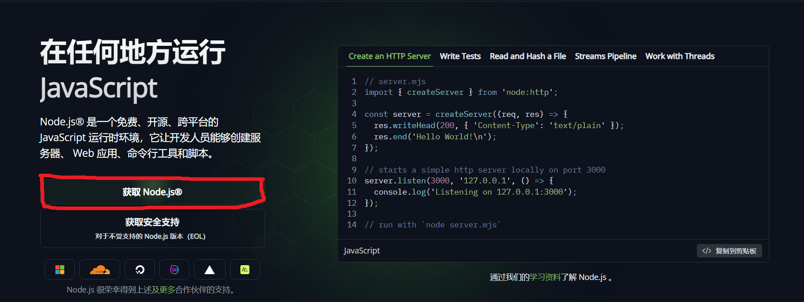
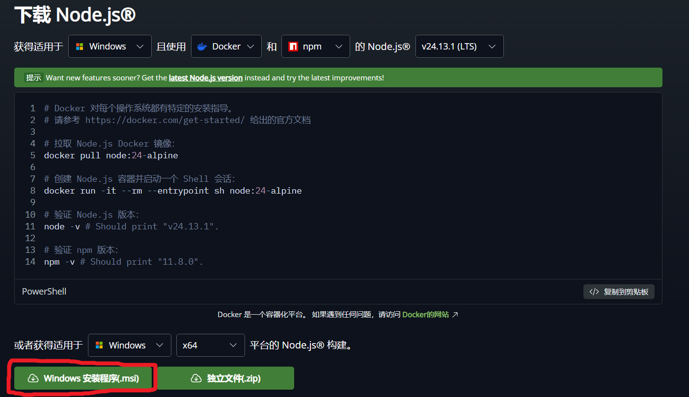
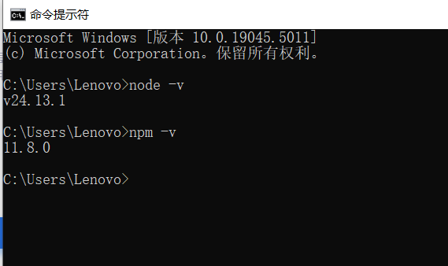
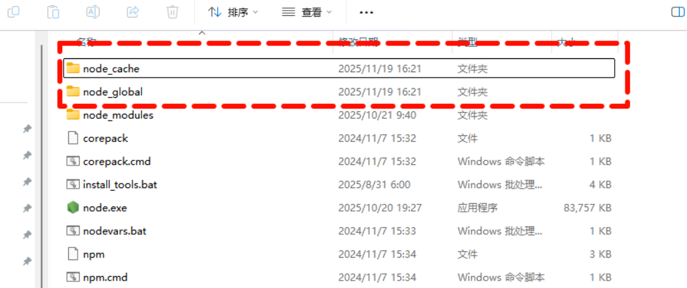
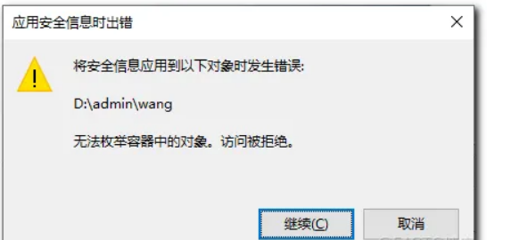

# 在 Windows 上安装和配置 Claude Code


## 步骤一：安装 Node.js18或更高版本

1. 访问[Node.js官方网站](https://nodejs.org/zh-cn/)
2. 点击获取Node.js，然后直接点击Windows安装程序(.msi)下载：




3. 安装Node.js：
    - 双击下载的.msi文件，启动安装程序。
    - 点击“下一步”按钮，接受许可协议。
    - 选择安装目录，点击“下一步”按钮。
    - 默认选项即可，一直点击next。
    - 点击“Install”按钮开始安装。
    - 安装完成后，点击“Finish”按钮退出安装程序。

4. 验证安装：
    - 打开命令提示符（CMD）
    - 输入”node -v“以下命令来检查Node.js是否安装成功。
      
    - 输入”npm -v“以下命令来检查npm是否安装成功。
    - 如果显示出版本号，则说明安装成功。



5. 配置npm(建议)

    - 配置国内源镜像:
    ```bash
    npm config set registry https://registry.npmmirror.com
    ```
    - 查看当前使用的镜像源:
    ```bash
    npm config get registry
    ```
    - 打开Nodejs的安装目标，新建"node_cache"和"node_global两个文件夹":
    
    - 关闭之间打开的cmd窗口，重新以管理员身份打开cmd窗口，通过命令将nodejs指向上面两个新建的文件夹。
    ```bash
    npm config set cache "D:\Nodejs\node_cache"
    npm config set prefix "D:\Nodejs\node_global"
    ```
    - 使用命令验证设置结果：
    ```bash
    npm config get cache
    npm config get prefix
    ```

6. 配置环境变量
    - 打开高级系统设置，点击环境变量：
    - 配置用户和系统变量：查看 Path 变量中是否已包含 Node.js 安装路径，如果没有，手动添加：D:\Nodejs 和 D:\Nodejs\node_global
    - 配置全局模块路径-环境变量新建变量名：NODE_PATH，变量值：D:\Nodejs\node_modules（根据你自己的Nodejs安装路径调整）。
    - 上述完成后，点击确定保存。
    - 设置权限---点击 Node.js 的安装文件夹，选择「属性」，在弹出的窗口中，进入「安全」选项卡，点击「编辑」按钮以修改权限。在下方的权限列表中，勾选「完全控制」旁的「允许」复选框。最后，点击「应用」再点击「确定」，使设置生效。
    - 权限设置可能存在的问题：
    
    -解决方法：进入「安全」选项卡，点击「高级」按钮，找到所有者，点击「更改」按钮后，点击「高级」按钮，再点击「立即查找」找到你想要的用户即可。

7. 测试npm
    - 打开新的命令提示符窗口（管理员身份），输入以下命令来测试 npm 是否配置成功：
    ```bash
    npm install express -g
    ```
    
    - 如上图，说明 npm 配置成功。(切记一定是在管理员身份下运行cmd!!!)


## 步骤二： Git安装

1. windows下安装Claude Code，git安装必不可少，详细安装地址可参考：[Git安装教程](https://blog.csdn.net/Little_Carter/article/details/155110165?fromshare=blogdetail&sharetype=blogdetail&sharerId=155110165&sharerefer=PC&sharesource=Little_Carter&sharefrom=from_link)

## 步骤三： 安装Claude Code

1. 安装
    - 管理员身份打开cmd窗口，输入:
    ```bash
    npm install -g @anthropic-ai/claude-code
    ```
    - 验证安装成功
    ```bash
    claude --version
    ```
    

2. 配置及潜在问题

    - 运行"claude"命令可能会出现以下错误
    ```bash
    Unable to connect to Anthropic services Failed to connect to api.anthropic.com: ERR_BAD_REQUEST Please check your internet connection and network settings. Note: Claude Code might not be available in your country. Check supported countries at https://anthropic.com/supported-countries
    ```
    - 解决方法：在C盘用户目标下”C:\Users\Lenovo“找到.claude.json文件，添加
    ```bash
    "hasCompletedOnboarding": true,
    ```
    
    
    - 关闭cmd窗口，重新以管理员身份打开cmd窗口，输入"claude"命令，即可使用。但初始使用时会提示登陆:
    ```bash
    /login
    ```
    
    这里一般是Anthropic的账号，需要去注册一个账号，需要充值等，作为个人用户，可以选择官方渠道也可以选择国内第三方渠道。


    - 下面介绍一下使用国内第三方中转渠道的用法：
    - 例如通过[https://api.weelinking.com/]注册一个API Key。
    - 在”C:\Users\Lenovo\.claude“目标下新建一个settings.json文件，添加如下内容：
    ```json
    {
          "env": {
            "ANTHROPIC_AUTH_TOKEN": "上一步创建的API Key复制过来",
            "ANTHROPIC_BASE_URL": "https://api.weelinking.com",
            "API_TIMEOUT_MS": "3000000",
            "CLAUDE_CODE_DISABLE_NONESSENTIAL_TRAFFIC": "1",
            "ANTHROPIC_MODEL": "claude-sonnet-4-5-20250929"
        },
        "alwaysThinkingEnabled": true
    }
    ```
    - 随后再以管理员身份打开cmd窗口，输入"claude"命令，即可正常使用。
    


